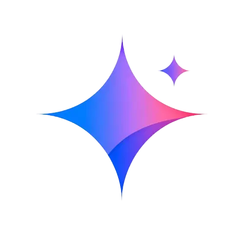

# ✨ Free Gemini & Google Flow Watermark Remover (Gemini Omni & Nano Banana)

<p align="center">
  <a href="https://permuteit.github.io/gemini-watermark-remover/">
    
  </a>
</p>

<p align="center">
  <strong>Remove visible Gemini and Google Flow watermarks from Gemini Omni videos and Nano Banana AI images online.</strong><br>
  Completely free, private, and runs 100% client-side in your web browser with zero quality loss.
</p>

<p align="center">
  <a href="https://permuteit.github.io/gemini-watermark-remover/"></a>
  <a href="https://github.com/permuteit/gemini-watermark-remover/stargazers"></a>
  
</p>

---

## 🌐 Live Website

👉 **Try it online:** [https://permuteit.github.io/gemini-watermark-remover/](https://permuteit.github.io/gemini-watermark-remover/)

---

## 💡 Why This Tool?

Most AI watermark removers use **generative AI inpainting**, which hallucinates missing pixels and blurs the background.

Google Gemini, Google Flow, Gemini Omni, and Veo models embed visible watermarks using **transparent alpha blending**. Because the underlying pixels are still present beneath the transparency, **Gemini Watermark Remover** uses exact mathematical unblending to subtract the watermark mask pixel-by-pixel, restoring **100% of your original image & video clarity** with zero quality loss.

$$\text{Original} = \frac{\text{Watermarked} - (\text{Logo} \times \alpha)}{1 - \alpha}$$

---

## 🚀 Features

- 🔒 **100% Private & Client-Side:** Files never leave your device. All rendering is handled locally in your browser via HTML5 Canvas and WebCodecs.
- 🖼️ **Gemini & Nano Banana Image Support:** Clean images (PNG, JPG, WebP) with instant high-resolution lossless PNG export.
- 🎬 **Gemini Omni, Google Flow & Veo 3 Video Support:** Fast frame-by-frame processing with MP4 export while preserving original audio tracks.
- 🎛️ **Live Tuner & Model Presets:** Quick-select model presets for Nano Banana, Gemini Omni, Flow, and Veo alongside real-time sliders and dual zoomed comparison views.
- ⚡ **Zero Quality Loss:** Restores exact pixel colors without blurry inpainting.
- 📱 **Fully Responsive:** Beautiful, clean, modern UI optimized for desktop, tablet, and mobile browsers.
- 🆓 **Unlimited & Free:** No signups, no subscriptions, and no secondary watermarks.

---

## 🛠️ Tech Stack

- **Frontend:** Pure Semantic HTML5, Modern Vanilla CSS (Custom Design System), JavaScript (ES6+)
- **Processing:** HTML5 Canvas API, WebCodecs API, [MediaBunny](https://github.com/diffusion-studio/mediabunny) for high-performance in-browser video unblending and AVC/H.264 muxing
- **Hosting:** GitHub Pages

---

## 💻 Local Development

Run the project locally with any static web server:

```bash
# 1. Clone the repository
git clone https://github.com/permuteit/gemini-watermark-remover.git

# 2. Navigate to project folder
cd gemini-watermark-remover

# 3. Start a local server (using Python 3, Node, or VS Code Live Server)
# Option A: Python
python3 -m http.server 8000

# Option B: Node.js (npx serve)
npx serve .
```

Open `http://localhost:8000` in your browser.

---

## 🤝 Contributing

Contributions, issues, and feature requests are welcome!
Feel free to check the [issues page](https://github.com/permuteit/gemini-watermark-remover/issues).

1. Fork the Project
2. Create your Feature Branch (`git checkout -b feature/AmazingFeature`)
3. Commit your Changes (`git commit -m 'Add some AmazingFeature'`)
4. Push to the Branch (`git push origin feature/AmazingFeature`)
5. Open a Pull Request

---

## 💖 Support

---

## 📄 License

Distributed under the MIT License. See `LICENSE` for more information.
